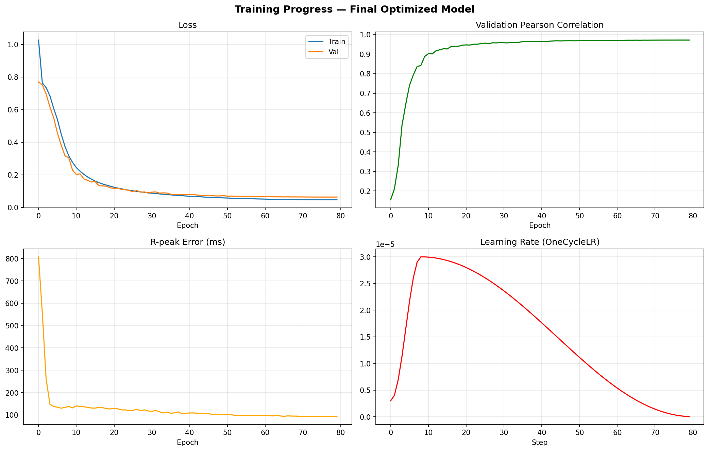
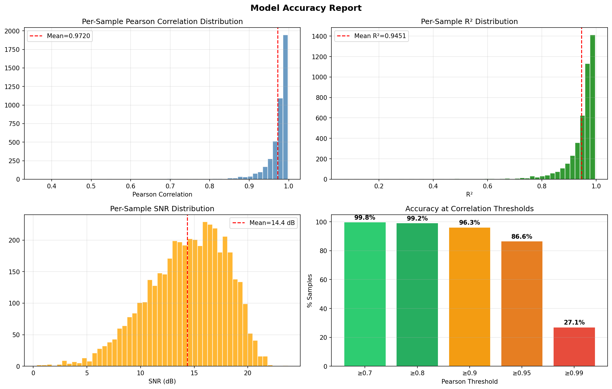

# ECG Image-to-Signal Reconstruction

Deep learning pipeline that reconstructs 1-D ECG signals from printed/rendered ECG paper images using a hybrid **CNN + Transformer** architecture.



## Problem Statement

Millions of legacy ECG records worldwide exist only as paper printouts, making them inaccessible to modern AI-based diagnostic tools and electronic health record systems. This project builds an end-to-end deep learning model that takes a clinical-standard ECG plot image as input and outputs the underlying digital time-series waveform.

## Architecture

```
ECG Image (1968×472 px)
        │
        ▼
┌─────────────────────┐
│   ResNet-18 Encoder  │   Pretrained on ImageNet, fine-tuned
│   (CNN Backbone)     │   Output: (B, 512, 7, 7) feature maps
└────────┬────────────┘
         │  Flatten to 49 spatial tokens
         ▼
┌─────────────────────┐
│  Spatial Transformer │   2 transformer blocks, 4 attention heads
│  Bridge (2 layers)   │   Learnable positional embeddings
└────────┬────────────┘
         │  Temporal projection
         ▼
┌─────────────────────┐
│  1-D Conv Decoder    │   ConvTranspose1d with residual skip connections
│  (6 upsampling stages)│  64 → 128 → 256 → 512 → 1024 → 2048 → 5000
└────────┬────────────┘
         │
         ▼
   ECG Signal (5000 samples)
```

## Results

Best model (epoch 79), evaluated on 4,360 validation samples:

| Metric | Value |
|--------|-------|
| Mean Pearson Correlation | 0.9720 ± 0.0362 |
| Median Pearson Correlation | 0.9818 |
| R² (Coefficient of Determination) | 0.9451 |
| RMSE | 0.2107 |
| MAE | 0.1258 |
| SNR | 14.4 ± 5.5 dB |

### Accuracy at Correlation Thresholds

| Threshold | % of Samples |
|-----------|-------------|
| ≥ 0.99 | 24.2% |
| ≥ 0.95 | 81.8% |
| ≥ 0.90 | 96.3% |
| ≥ 0.80 | 99.1% |



## Dataset

**PTB-XL v1.0.3** from [PhysioNet](https://physionet.org/content/ptb-xl/1.0.3/)

- 21,799 twelve-lead ECG recordings from ~18,885 patients
- 10-second recordings at 100 Hz (1000 samples each)
- Lead I extracted for single-lead image-to-signal task
- WFDB format (`.hea` + `.dat`)

## Project Structure

```
├── ecg_pipeline.py                  # Data generation: WFDB → filter → ECG image + signal
├── ecg_image_to_signal_trainer.py   # Model architecture, dataset, training loop
├── save_preprocessed_data_optimized.py  # Preprocess & cache data for fast training
├── train_ecg_final.ipynb            # Training notebook (run end-to-end)
├── ECG_Pipeline_Report.docx         # Detailed project report
├── checkpoints_final/               # Training curves & comparison plots
├── requirements.txt                 # Python dependencies
└── .gitignore
```

## Pipeline

1. **Data Generation** (`ecg_pipeline.py`)  
   Load raw WFDB records → 4th-order Butterworth bandpass filter (0.5–40 Hz) → render clinical-standard ECG plot image → save paired (image, signal)

2. **Preprocessing** (`save_preprocessed_data_optimized.py`)  
   Resize images, interpolate signals to fixed length, split into train/val, cache as tensors

3. **Training** (`train_ecg_final.ipynb` / `ecg_image_to_signal_trainer.py`)  
   Mixed-precision training with composite loss (MSE + Pearson correlation + derivative loss), cosine annealing LR, early stopping

## Tech Stack

| Category | Tools |
|----------|-------|
| Deep Learning | PyTorch 2.6, torchvision (ResNet-18), CUDA 12.4 |
| Signal Processing | SciPy (Butterworth filter, `find_peaks`), wfdb |
| Image Processing | OpenCV, Pillow, Matplotlib |
| Data Handling | NumPy, Pandas |
| Hardware | NVIDIA RTX 3050 6GB |

## Setup

```bash
# Clone the repo
git clone https://github.com/Aryakatoch17/ecg-image-to-signal.git
cd ecg-image-to-signal

# Create virtual environment
python -m venv .venv
source .venv/Scripts/activate   # Windows
# source .venv/bin/activate     # Linux/Mac

# Install dependencies
pip install -r requirements.txt

# Download PTB-XL dataset from PhysioNet
# https://physionet.org/content/ptb-xl/1.0.3/

# Generate paired data
python ecg_pipeline.py

# Preprocess for training
python save_preprocessed_data_optimized.py

# Train (open notebook or run trainer directly)
```

## Loss Function

Composite loss with warmup:

- **SmoothL1 / MSE Loss** — pixel-level signal reconstruction
- **Pearson Correlation Loss** (1 − r) — waveform shape matching (warmed up after epoch 3)
- **Derivative Loss** — preserves sharp features like QRS complexes

## Evaluation Metrics

- **Pearson Correlation** — waveform similarity (shape)
- **R²** — coefficient of determination
- **RMSE / MAE** — amplitude error
- **SNR** — signal-to-noise ratio
- **R-peak Error** — clinically critical QRS detection accuracy (via `scipy.signal.find_peaks`)

## License

This project uses the PTB-XL dataset, which is available under the [Open Data Commons Attribution License](https://physionet.org/content/ptb-xl/1.0.3/).
